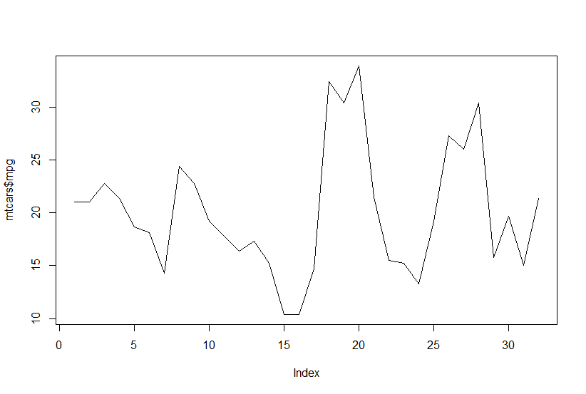

Se você já plotou um gráfico de linhas no R e, quando viu o plot no painel do RStudio pensou "uau, que qualidade terrível!", você não está só. Mas não se preocupe, a solução é bem simples!

Primeiramente, vamos plotar um gráfico na configuração padrão do RStudio:

`plot(mtcars$mpg, type = "l")`



Wow, imagine usando algo assim em um banner! Vamos tentar de novo, agora com o Cairo como dispositivo gráfico e usando anti-aliasing:

```{r, echo = FALSE}

blogdown::shortcode("highlight", "r", .content = '
# Adicionando anti-aliasing
trace(grDevices::png, quote({
  if (missing(type) && missing(antialias)) {
    type = "cairo-png"
    antialias = "subpixel"
  }
}), print = FALSE)

# Plotando novamente
plot(mtcars$mpg, type = "l")
')
```

```{r, echo = FALSE}
plot(mtcars$mpg, type = "l")
```

Santo anti-aliasing, não é? (Dê zoom nos dois para ver bem a diferença)

Bom, preciso fazer isso toda vez que for plotar um gráfico ou iniciar uma sessão no R? De forma alguma, basta adicionar essas linhas ao seu .Rprofile. Eu recomendo sempre usar o {usethis} para alterar os arquivos de configuração, pois você pode acabar se perdendo dentre os caminhos possíveis onde o R irá consultar. Usando o {usethis} você garante que estará criando ou editando o arquivo correto.

`usethis::edit_r_profile()` irá abrir uma janela com o arquivo para edição. Então, cole a chamada acima (retirando a linha do plot, claro), certifique-se que o .Rprofile acabe com uma linha vazia (porque o R ignora a última linha), salve e reinicie a sessão. Pronto! Agora o anti-aliasing sempre será aplicado aos seus plots no R, independente do pacote utilizado, seja o base ou o {ggplot}, por exemplo.
