I first installed VSCode in october 2020 when I've decided to learn Python. Looking for the ideal setup, I've read somewhere that Spyder would be the best IDE for R [@R] users due to similarities with RStudio, but I wanted the same experience as a native Python user so I've decided to go with VSCode (even if that meant a tougher xp at the time).
{}

I quickly fell in love with it's flexibility and maturity. There are community extensions for about everything, which makes ux delightful! However, R ecosystem was still very much geared towards RStudio and I still found myself stuck with that IDE in my day-to-day life with R. That changed, of course, when I saw this tweet from [Miles McBain](https://twitter.com/MilesMcBain):
{}

Moving on to consider VSCode as a real possibility for R, I found this [post](https://renkun.me/2019/12/11/writing-r-in-vscode-a-fresh-start/) from [Kun Ren](https://twitter.com/renkun_ken) that offers a setup for R with VSCode. In this post I write about my favorite features and what settings that I use.

# WHAT'S SO GOOD ABOUT IT THO `r emo::ji("thinking_face")`?

Most features implemented by R and Language Server extensions are detailed in [Kun Ren's post](https://renkun.me/2019/12/11/writing-r-in-vscode-a-fresh-start/), so, if you didn't read that yet, just GO! Here's some stuff I like about it.

## Intellisense

That's what is called VSCode's code editing features, like **quick info** (docs for functions, datasets etc) and **parameter info** (args definition), just by hovering over it. It also includes **code completion**, **member list** and more.

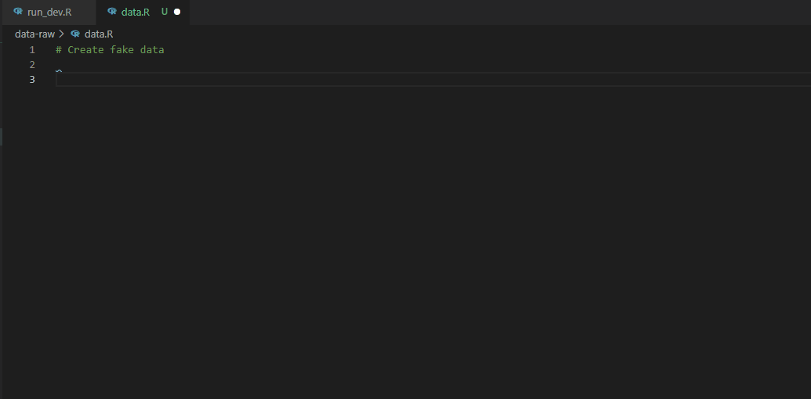


## Git & GitHub integration

[GitHub Pull Requests and Issues ](https://marketplace.visualstudio.com/items?itemName=GitHub.vscode-pull-request-github) and [Git Lens](https://marketplace.visualstudio.com/items?itemName=eamodio.gitlens) extensions provide a very useful GitHub integration, so you don't have to leave your IDE for nothing. You can open, comment and close issues and PRs; submit, view and edit commits; execute most common bash commands via command pallet  (push, pull, checkout, prune, rebase etc) and other stuff.

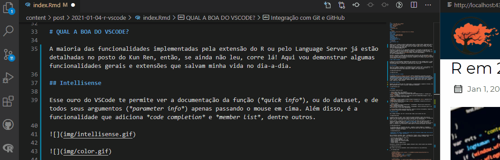

Clicking on the issue, VSCode opens a new branch and checks it out for you to work on (and still triggers a personalized commit message!). 

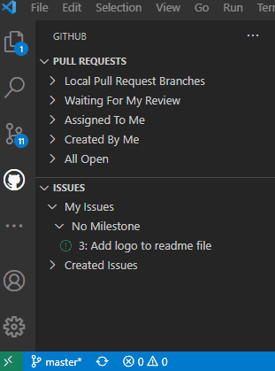

And, at the end of the work, just click on create new PR to push the branch to origin and bring the PR interface. All without opening the browser or a terminal.


## Multiple terminals

While your blog or Shiny app is rendering and consequently occupying one terminal, you can simply open another one and continue working normally!

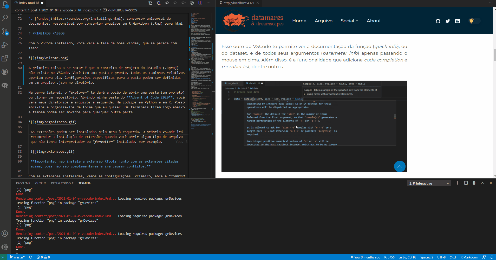

## Draw.io

This is an example of one of the many useful extensions that the community makes available on VSCode. The [draw.io extension](https://marketplace.visualstudio.com/items?itemName=hediet.vscode-drawio) integrates [diagrams.net](https://app.diagrams.net/) into VSCode. With it, you can make diagrams very quickly and without having to leave your IDE! 

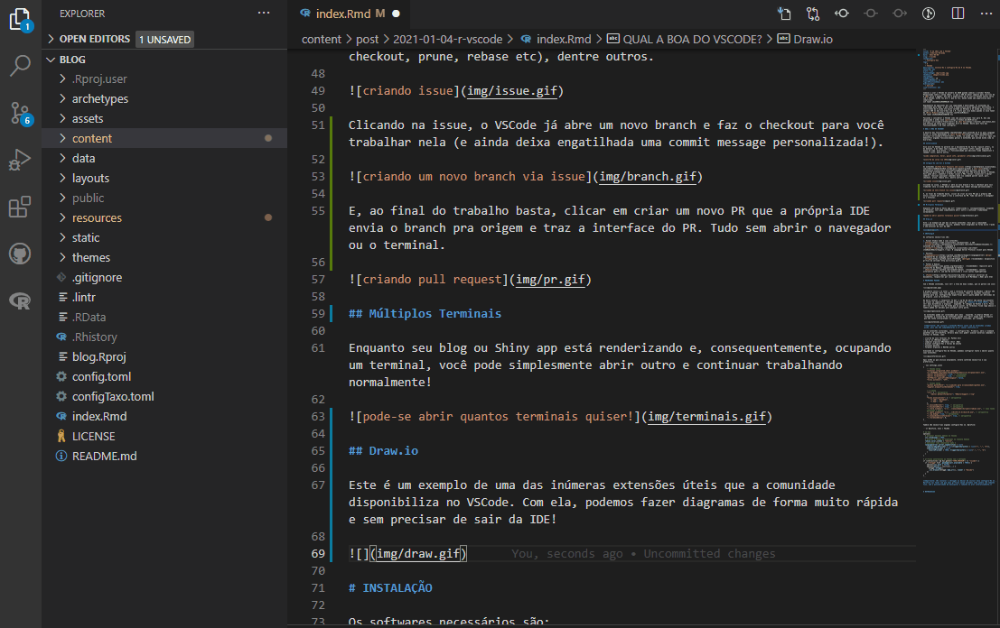

 using it](img/diagrama.png)

## Live Share

Ever dreamed of working on the same script with your boys live? The [Live Share extension](https://marketplace.visualstudio.com/items?itemName=MS-vsliveshare.vsliveshare) allows it and also provides chat and audio channels, which makes it unnecessary to open an audio call on another app while you work!

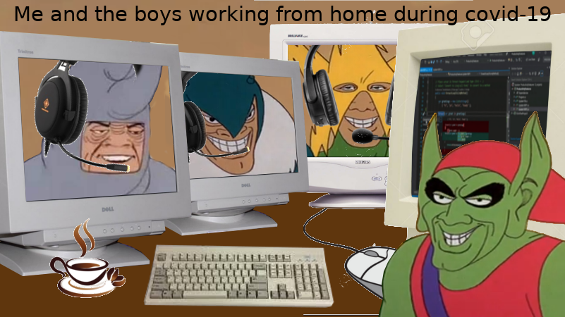

Also, you don't need to have the language interpreter installed to join the session. That means that even if you're on another machine that doesn't have R or Python (or else) installed, you can log in and collaborate on your colleagues' scripts, even running the code through their terminals!

 

## Windows Subsystem for Linux

Are you in a Windows machine and and ever needed to debug some stuff in a Linux environment? Then you had the displeasure of installing virtual machines or dual boot (╯°□°）╯︵ ┻━┻

Good news: with the [Remote - WSL](https://marketplace.visualstudio.com/items?itemName=ms-vscode-remote.remote-wsl) extension you're just one click away from happiness. It copies your folder (project) and reopens it in a Linux environment, with a terminal ready for business!

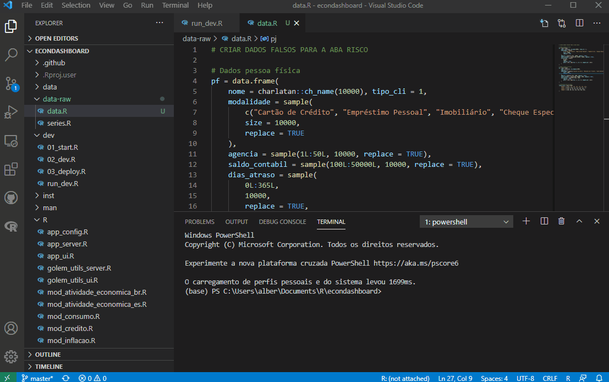

## Linter

R extension integrates the {lintr} package into the IDE, so you have real time styling updates.

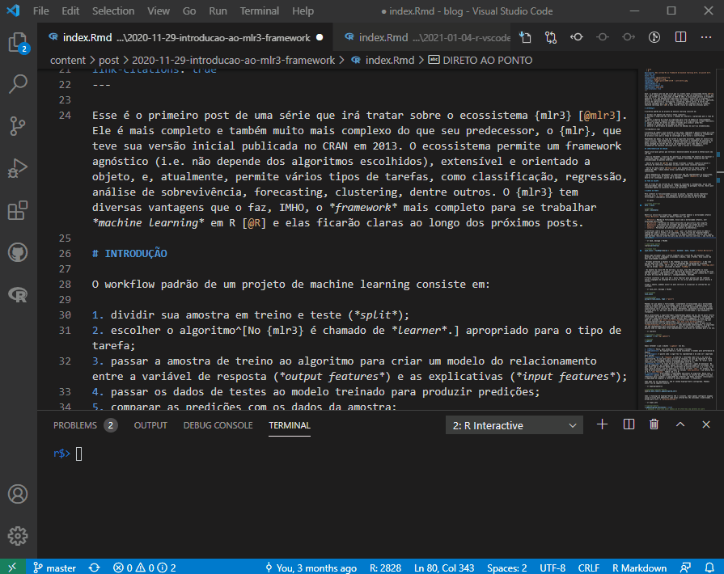

# SETTINGS

To get started you only need VSCode and R and R-LSP extensions. But here I share the setup that I think provides the best experience: 

1. Visual Studio Code and extensions:
- [VSCode](https://code.visualstudio.com/download): the IDE
- [vscode-R](https://marketplace.visualstudio.com/items?itemName=Ikuyadeu.r): R language support
- ~~[vscode-r-lsp](https://marketplace.visualstudio.com/items?itemName=REditorSupport.r-lsp): R Language Server Protocol Client for VSCode~~ ^[now integrated in vscode-R extension.]

2. Packages:
- [languageserver](https://github.com/REditorSupport/languageserver) [@lsp]: R Language Server Protocol implementation
- [httpgd](https://github.com/nx10/httpgd) [@httpgd] (recommended): asynchronous http server  graphic device for R

3. Python & Radian:
- [Python](https://www.python.org/downloads/)  (recommended): requirement for Radian, implemented in Python
- [Radian](https://github.com/randy3k/radian)  (recommended): alternative R console, with multi line editing and rich syntax highlighting

4. [Pandoc](https://pandoc.org/installing.html): Universal document converter, responsible for converting R Markdown (.Rmd) files to html. You didn't need to install it before because the RStudio installer comes with a version of Pandoc included.

# FIRST STEPS

With VSCode installed, you'll see the welcome screen, which looks like this:

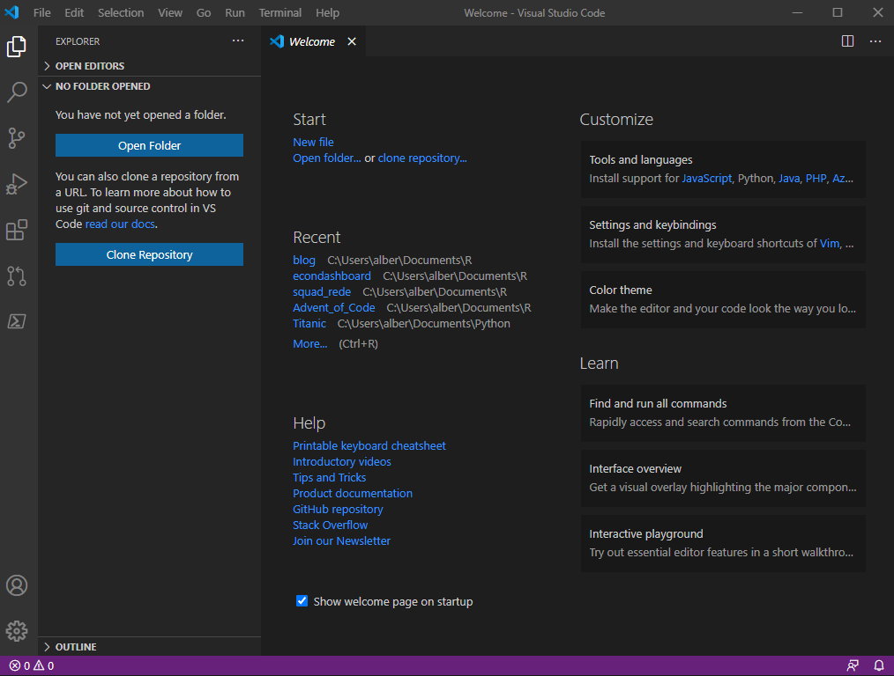

The first thing to note is that the RStudio project concept (.Rproj) does not exist in VSCode. You have a folder and that's it, all relative paths point to it. Folder-specific settings can be defined in a .json file in the directory.

In the sidebar, the explorer tab will give you the option to open a folder (a project) or clone a repository. Opening my **Advent of Code 2020** folder, you will see my directories and files on the left. There is code in Python and in R. I can open it and organize it any way I want. The terminals are below and they can also be moved elsewhere.

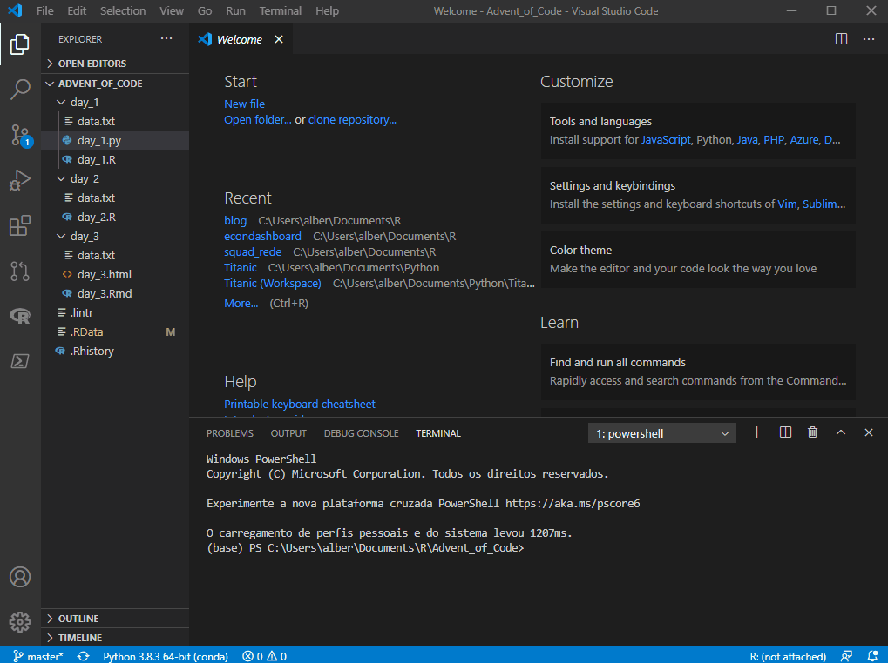

 Extensions can be installed from the tab on the left. VSCode itself will recommend installing extensions when you open some kind of file that doesn't have an interpreter or formatter installed, for example.

 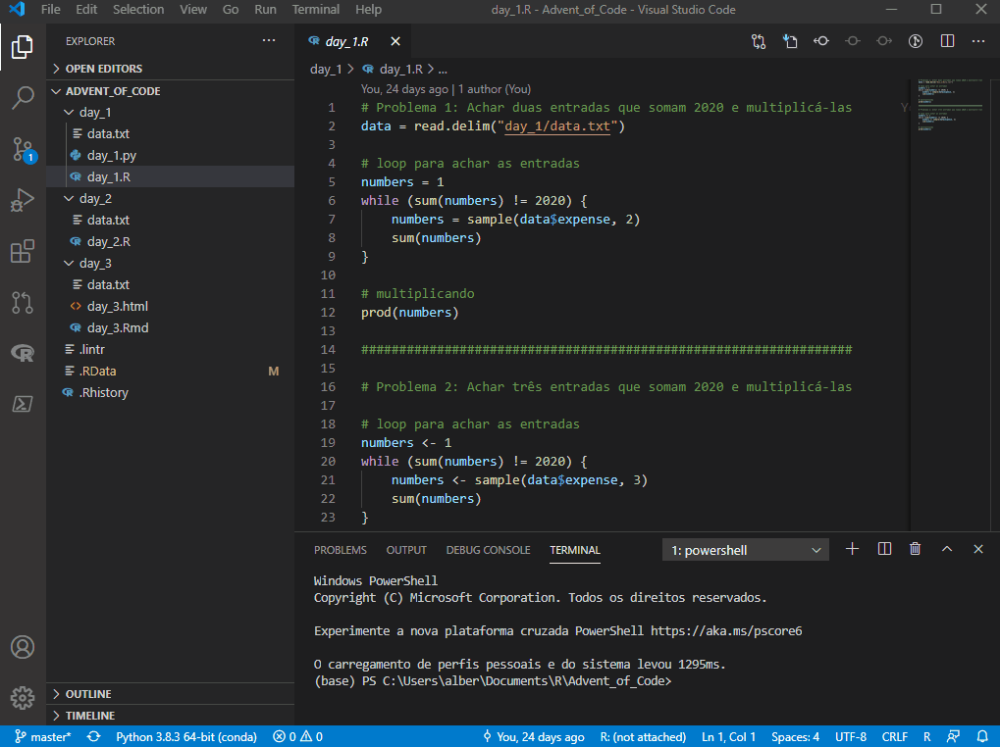

 **Important: do not install the RTools extension together with the extensions mentioned above, as they are not complementary and will cause conflicts.**

With the extensions installed, let's go to settings. First, open the command palette with ctrl+shift+p. There you'll be able to access several commands and shortcuts in VSCode, such as:

- new terminal (R, Python etc)
- launch *RStudio addins*
- compile RMarkdown files (knit .Rmd)
- access settings and shortcut keys
- install packages
- format files and MANY others

Accessing the VSCode settings, we can configure both the editor and its extensions:

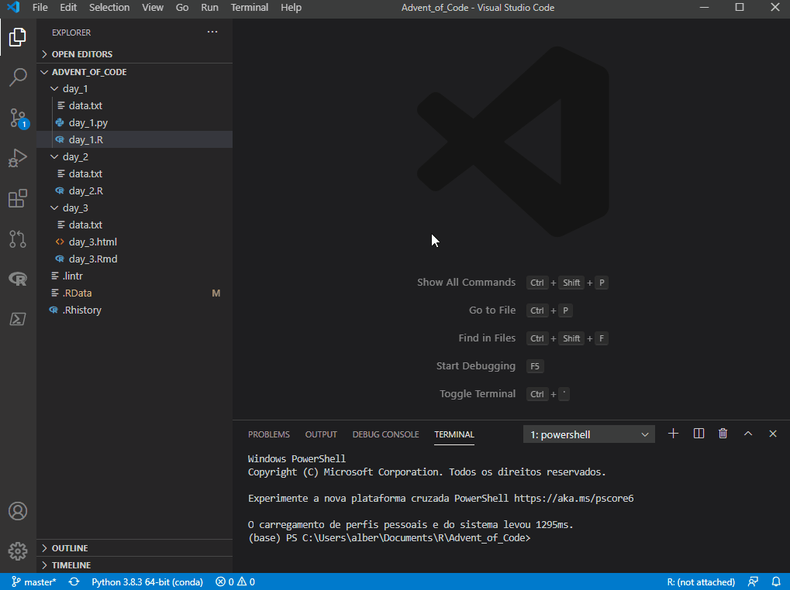

Here are the ones I currently use. Change as needed and according to your preference. Obs.: by the time you're reading this they may be changed, since R support is on active development.

```{r settings.json, echo = FALSE}

blogdown::shortcode("highlight", "js", .content = '
{
    // VSCode setup
    "terminal.integrated.shell.windows": "C:\\WINDOWS\\System32\\WindowsPowerShell\\v1.0\\powershell.exe",
    "editor.formatOnPaste": true, // recommended
    "editor.formatOnType": true, // recommended
    "diffEditor.ignoreTrimWhitespace": false,
    "files.autoSave": "off",

    // Python setup
    "python.pythonPath": "C:\\...\\anaconda3\\python.exe",
    "jupyter.alwaysTrustNotebooks": true,

    // R setup
    "[r]": { // required
        "editor.defaultFormatter": "REditorSupport.r-lsp"
    },
    "files.associations": { // required
        "*.rmd": "markdown",
        "*.Rmd": "rmd"
    },
    "r.sessionWatcher": true, // default
    "r.bracketedPaste": true, // required
    "r.rterm.windows": "C:\\...\\anaconda3\\Scripts\\radian.exe", // for Radian
    "r.rpath.windows": "C:\\...\\R\\R-4.1.0\\bin\\R.exe", // required
    "r.lsp.debug": true, // required
    "r.alwaysUseActiveTerminal": true, // required
    "r.rtermSendDelay": 0,
}'
)
```

And a few tweaks on your .Rprofile:

```{r Rprofile, echo = FALSE}

blogdown::shortcode("highlight", "r", .content = '
# options
options(
  # activate RStudio Addins on command pallet
  vsc.rstudioapi = TRUE,
  # interactive plots with {httpgd}
  vsc.use_httpgd = TRUE,
  # radian highlight scheme (choose what suits you)
  radian.color_scheme = "native",
  # code completion triggers
  languageserver.server_capabilities = list(
    signatureHelpProvider = list(triggerCharacters = list("(", ",", "$")),
    completionProvider = list(
      resolveProvider = TRUE, triggerCharacters = list(".", ":", "$")
    )
  )
)
')
```

**Important: not installing {httpgd} or not including this setting in .Rprofile will cause your graphics to be plotted in a fixed-size window, without the possibility of manipulating the plot size interactively.** 

# AT LAST

And that's it for the basics! There's still a lot of things to explore but you can already get an idea of the tool's potential :p 

# CITATION

{}

# REFERENCES