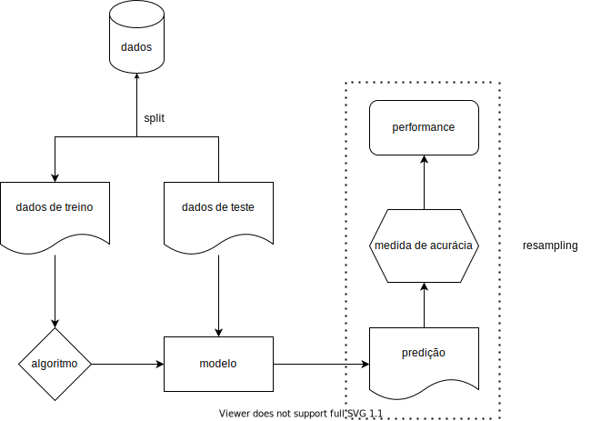

Esse é o primeiro post de uma série que irá tratar sobre o ecossistema {mlr3} [@mlr3]. Ele é mais completo e também muito mais complexo do que seu predecessor, o {mlr}, que teve sua versão inicial publicada no CRAN em 2013. O ecossistema permite um framework agnóstico (i.e. não depende dos algoritmos escolhidos), extensível e orientado a objeto, e, atualmente, permite vários tipos de tarefas, como classificação, regressão, análise de sobrevivência, forecasting, clustering, dentre outros. O {mlr3} tem diversas vantagens que o faz, IMHO, o *framework* mais completo para se trabalhar *machine learning* em R [@R] e elas ficarão claras ao longo dos próximos posts.

# INTRODUÇÃO

O workflow padrão de um projeto de machine learning consiste em:

1. dividir sua amostra em treino e teste (*split*);
2. escolher o algoritmo^[No {mlr3} é chamado de *learner*.] apropriado para o tipo de tarefa;
3. passar a amostra de treino ao algoritmo para criar um modelo do relacionamento entre a variável de resposta (*output features*) e as explicativas (*input features*);
4. passar os dados de testes ao modelo treinado para produzir predições;
5. comparar as predições com os dados da amostra;
6. mensurar a performance do modelo através de medidas de acurácia estabelecidas.



O processo de repetir esse workflow várias vezes, separando a amostra treino em várias partes diferentes e usando outras como *fake test samples* é chamado de *resampling*, um processo vital para a etapa de calibragem e para evitar o *overfitting*.

Dependendo dos dados, do tipo de tarefa e algoritmo escolhido, podem ser necessários vários filtros, como normalização, *feature selection* e tratamento de *outliers* ou dados faltantes. Para esses casos, o {mlr3} tem novas soluções que se destacam com muita vantagem em relação não só ao seu predecessor {mlr} como também a outros *frameworks* de *machine learning* em R, como o {caret} e o {tidymodels}.

## CARACTERÍSTICAS DE DESIGN

Alguns princípios gerais que norteiam o desenvolvimento do pacote e afetam muito seu uso são:

- Foco no *backend*. A maioria dos pacotes do ecossistema tem objetivo de processar e transformar dados, aplicar algoritmos e computar resultados. Visualizações são providenciadas em pacotes externos;

- Adoção da classe R6 [@R-R6] para design orientado a objeto, *modify-in-place* e semântica de referência (falaremos um pouco sobre esses conceitos adiante);

- Adoção do {data.table} [@R-data.table] para manipulações de *data frames*. A combinação {R6} + {data.table} torna a performance um dos pontos fortes do ecossistema. 

- Baixa dependência. Entretanto, os algortimos não são implementados no ecossistema, como no scikit-learn em Python. Para executar o XGBoost [@xgboost], por exemplo, deve-se ter instalado o pacote que o implementa.

## FORA DO ESCOPO

Como se trata de uma introdução, as etapas de *tunning* e *resampling*, assim como funcionalidades como os *pipelines*, serão abordadas em postagens futuras. Neste post trataremos apenas os conceitos básicos do *workflow*.

# DIRETO AO PONTO

Para conhecer as funcionalidades básicas do pacote, usaremos um dos *datasets* inclusos no R, o `swiss`. Esse *dataset* consiste na medição padronizada da fertilidade e indicadores socioeconômicos de 47 províncias da Suíça em 1888.

```{r data, echo = FALSE}

knitr::opts_chunk$set(
  echo = FALSE
)

blogdown::shortcode("highlight", "r", .content = "
# criando dataframe
data = swiss

# overview
skimr::skim(data)
")

# criando dataframe
data = swiss

# overview
skimr::skim(data)
```

Dentre as vari]]áveis disponíveis, podemos escolher modelar a mortalidade infantil `Infant.Mortality` baseada nas demais features, que são:

- `Fertility`: Medida de fertilidade. Assim como a mortalidade infantil, está escalonada entre 0-100.
- `Agriculture`: Percentual de homens envolvidos em agricultura como ocupação.
- `Examination`: Percentual de alistados bem avaliados nos exames do exército.
- `Education`: Percentual dos alistados com educação superior ao primário.
- `Catholic`: Percentual de católicos (em oposto a protestantes).

O *workflow* começa pela criação da `task`, que é um objeto que contém os dados e informações sobre a tarefa a ser executada, como a variável de resposta^[Também chamada de *output feature* ou *label*.] e as demais *features*, além de seus tipos. Como queremos realizar predições para uma variável numérica contínua, é uma tarefa de regressão.

```{r task, message = FALSE, warning = FALSE}

blogdown::shortcode("highlight", "r", .content = '
# importando pacote
library(mlr3verse)

# criando task
task_swiss = TaskRegr$new(
  id = "swiss",
  backend = data,
  target = "Infant.Mortality"
)
')

# importando pacote
library(mlr3verse)

# criando task
task_swiss = TaskRegr$new(
  id = "swiss",
  backend = data,
  target = "Infant.Mortality"
)
```

Notou algo estranho? Como o {mlr3} trabalha com a classe R6, seu manuseio é mais parecido com outras linguagens orientadas a objeto, como o Python. Essa classe tem duas propriedades especiais:

- Métodos pertencem a objetos e são chamados na forma `objeto$metodo()` e não como funções genéricas como `foo()`. Esse é o paradigma OOP (programação orientada à objetos). No caso acima, não há uma função para criar uma *task* como `task_regr_new()`, mas um método `new()` associado ao objeto `TaskRegr`;

- Os objetos da classe R6 são mutáveis, ou seja, eles são modificados no local (*modify-in-place*) e, portanto, têm semântica de referência. Isso significa que eles não são copiados a cada modificação, como os *data frames* comuns (classe S3), o que é um fator de alocação de memória e, consequentemente, lentidão.

O efeito colateral é que isso não é muito familiar para pessoas que não conhecem outras linguagens de programação além do R e no início pode parecer pouco natural e confuso.

Criado o objeto, podemos acessá-lo para verificar e visualizar as informações ali contidas:

```{r task_cont, message = FALSE}

blogdown::shortcode("highlight", "r", .content = '
# verificando
task_swiss

# visualizando
autoplot(task_swiss, type = "pairs")
')

# verificando
task_swiss

# visualizando
autoplot(task_swiss, type = "pairs")
```

Podemos ver que apenas a fertilidade é linearmente correlacionada com a mortalidade infantil — quanto maior a fertilidade, maior a mortalidade —, e podemos esperar que tenha maior peso nas predições. As demais variáveis não apresentam correlação linear significativa com a variável de resposta. Entretanto, apresentam correlação moderada ou forte entre si, mas não a ponto de apresentar colinearidade, o que demandaria tratamento.

Agora selecionamos o algoritmo^[Aqui trabalharemos apenas com um, mas em posts futuros utilizaremos de diversas formas — pipelines com diferentes *features*, *stacking* etc.] que será usado para treinar o modelo. Escolhi aqui o *XGBoost*. A lista completa pode ser acessada [por essa lista estática](https://mlr3extralearners.mlr-org.com/articles/learners/learner_status.html), [por essa lista dinâmica](https://mlr3extralearners.mlr-org.com/articles/learners/list_learners.html) ou pela função `mlr3extralearners::list_mlr3learners()`. Como mencionado anteriormente, os algoritmos não são implementados pelo ecossistema do {mlr3} e nas listas citadas constam os pacotes onde os algoritmos foram implementados e que devem ser baixados para o seu uso.

```{r learner}

blogdown::shortcode("highlight", "r", .content = '
# definindo o learner
l_xgboost = lrn("regr.xgboost")

# checando
l_xgboost
')

# definindo o learner
l_xgboost = lrn("regr.xgboost")

# checando
l_xgboost
```

Vamos entender o que o objeto `l_xgboost` nos diz.

1. **Model**: Vazio, pois ainda não há um modelo treinado;
2. **Parameters**: Os hiperparâmetros a serem escolhidos e tunados para performance do modelo;
3. **Packages**: O pacote onde o algorítmo foi implementado e de onde será importado pelo {mlr3};
4. **Predict Type**: Se `response` a predição é retornada como 0 ou 1, no caso de classificação, ou num valor para variável de resposta, no caso de regressão — neste caso, será a mortalidade infantil escalonada no intervalo [1, 100]. Se "prob", para classificação, a predição retorna a probabilidade entre 0 e 1;
5. **Feature Type**: Os tipos de variáveis que o algoritmo é capaz de manipular. No caso do *XGBoost*, por exemplo, apenas variáveis numéricas podem ser utilizadas. Isso quer dizer que os fatores devem ser convertidos em valores binários (i.e. 0 ou 1), ou seja, deve-se tornar a matriz esparsa — no caso de um fator `sexo`, por exemplo, na fase de pre-processamento seriam criadas as colunas `sexo.masculino`, com valores de 1 ou 0, e `sexo.feminino`, também com 1 ou 0;
6. **Properties**: Propriedades e capacidades adicionais do algoritmo. Neste caso, o **XGBoost** possui a capacidade de computar e retornar os valores da importância das *features* para o modelo; a capacidade de trabalhar com dados faltantes (*missings*); a capacidade de computar e retornar os pesos associados às *features*.

Como pode ver em *parameters*, não há nenhum hiperparâmetro configurado. Podemos acessá-los da seguinte maneira:

```{r hyperparameters}

blogdown::shortcode("highlight", "r", .content = "
# acessando hiperparâmetros
head(as.data.table(l_xgboost$param_set))
")

# acessando hiperparâmetros
head(as.data.table(l_xgboost$param_set))
```

Como o *tunning* de hiperparâmetros não é o assunto, vamos apenas configurar algumas coisas básicas para demonstrar como essas informações são acessadas e modificadas. O método para isso é o `param_set$values`:

```{r hiper_set}

blogdown::shortcode("highlight", "r", .content = "
# hiperparâmetros
l_xgboost$param_set$values = list(
  # mandando o algoritmo parar depois de 10 iterações sem melhora no score
  early_stopping_rounds = 10,
  # mandando o algoritmo treinar mais lentamente
  eta = 0.1,
  # limitando profundidade da árvore
  max_depth = 5,
  # quantidade máxima de iterações
  nrounds = 100
)

# verificando
l_xgboost
")

# hiperparâmetros
l_xgboost$param_set$values = list(
  # mandando o algoritmo parar depois de 10 iterações sem melhora no score
  early_stopping_rounds = 10,
  # mandando o algoritmo treinar mais lentamente
  eta = 0.1,
  # limitando profundidade da árvore
  max_depth = 5,
  # quantidade máxima de iterações
  nrounds = 100
)

# verificando
l_xgboost
```

# TREINO E PREDIÇÃO

As próximas etapas são o treino e a predição — trataremos de *tunning* e *resampling* nos próximos posts. Primeiramente, o *split* do dataset em treino e teste. Para isso, usaremos a função `sample()` em dois métodos do objeto `task_swiss`, o `row_ids` e `nrow`. O primeiro enumera os índices de cada linha:

```{r row_ids}

blogdown::shortcode("highlight", "r", .content = "
# método row_ids
task_swiss$row_ids
")

# método row_ids
task_swiss$row_ids
```

Enquanto o segundo retorna a quantidade de linhas do dataset:

```{r nrow}

blogdown::shortcode("highlight", "r", .content = "
# método row_ids
task_swiss$nrow
")

# método row_ids
task_swiss$nrow
```

Assim, podemos selecionar os índice do dataset em duas amostras aleatórias:
```{r indexes}

blogdown::shortcode("highlight", "r", .content = "
# garantindo reprodutibilidade
set.seed(1)

# índices para amostra treino
train_set = sample(task_swiss$row_ids, 0.7 * task_swiss$nrow)

# índices para amostra teste
test_set = setdiff(task_swiss$row_ids, train_set)

# verificando
head(train_set)
")

# garantindo reprodutibilidade
set.seed(1)

# índices para amostra treino
train_set = sample(task_swiss$row_ids, 0.7 * task_swiss$nrow)

# índices para amostra teste
test_set = setdiff(task_swiss$row_ids, train_set)

# verificando
head(train_set)
```

Com os índices selecionados, podemos realizar nosso treino apenas nos 70% escolhidos aleatoriamente da amostra, sem copiar os dados e alocar memória desnecessariamente:

```{r treino, warning = FALSE}

blogdown::shortcode("highlight", "r", .content = "
# treino
l_xgboost$train(task_swiss, row_ids = train_set)

# verificando
l_xgboost$model
")

# treino
l_xgboost$train(task_swiss, row_ids = train_set)

# verificando
l_xgboost$model
```

Como podemos ver, na primeira iteração o modelo obteve *rmse*^[Raiz do Erro Médio Quadrático]. de 17.7, o que é alto considerando a escala [1-100] da mortalidade infantil. Ao longo do treino, o erro foi reduzido até 0.03, o que não significa que sua performance permaneça nesse nível quando extrapolado para a amostra teste ou novos dados, mas é um bom sinal. O esperado é que a performance real do modelo, após ser aplicado à amostra teste, fique entre a iteração inicial e final. Se ficar *melhor* do que a performance do teste, alguma coisa certamente está errada.

Vamos verificar qual a performance real após realizarmos as predições na amostra teste. Primeiro, passamos os índices de teste ao objeto do *learner* com o modelo e chamamos o método `predict()` para obter as predições.

```{r predictions}

blogdown::shortcode("highlight", "r", .content = "
# predições
preds = l_xgboost$predict(task_swiss, row_ids = test_set)

# verificando
preds
")

# predições
preds = l_xgboost$predict(task_swiss, row_ids = test_set)

# verificando
preds
```

No objeto com as predições, são armazenados tanto os valores preditos pelo modelo `response` quanto os valores da amostra `truth`. Esses valores então podem ser comparados para calcular a acurácia do modelo através do método `score()`:

```{r accuracy}

blogdown::shortcode("highlight", "r", .content = '
# acurácia
preds$score(list(
  msr("regr.rmse"),
  msr("regr.mae")
))

# visualizando
autoplot(preds)
')

# acurácia
preds$score(list(
  msr("regr.rmse"),
  msr("regr.mae")
))

# visualizando
autoplot(preds)
```

A *rmse* do modelo na amostra teste ficou em apenas 2.59 unidades, o que é uma performance muito boa!

# INTERPRETAÇÃO

Como o XGBoost possui a propriedade de *feature importance*, podemos extraí-la com o método `importance()`:

```{r importance}

blogdown::shortcode("highlight", "r", .content = "
# feature importance
l_xgboost$importance()

# visualizando
barplot(l_xgboost$importance())
")

# feature importance
l_xgboost$importance()

# visualizando
barplot(l_xgboost$importance())
```

Entretanto, somente a importância não nos descreve o relacionamento da *feature*  com a variável de resposta, nem mesmo sua direção, sendo uma medida muito pobre de interpretação. Discutiremos técnicas de interpretação em outras postagens.

# CITAÇÃO

{}

# REFERÊNCIAS